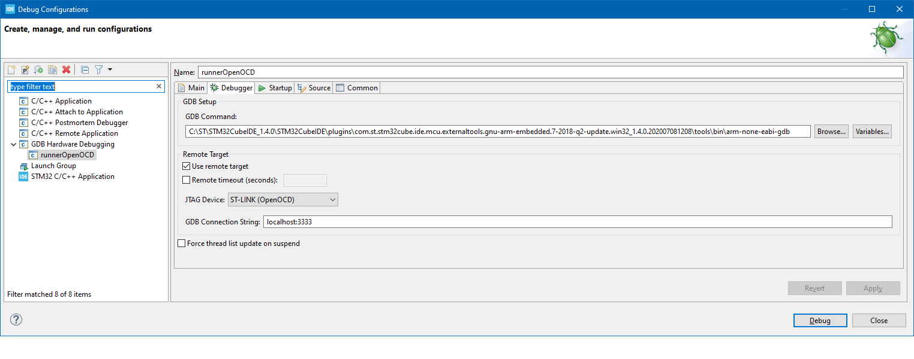

# Introduction
This directory contains the build infrastructure for STM32F4 MCU using the STM32Cube FW SDK.  The STM32F4 device configuration matches that of the STM32F437VG device that is mounted on the u-blox C030 board and configures it sufficiently well to run the `ubxlib` tests and examples: no attempt is made to optimise the MCU RAM/flash etc. sizes, you need to know how to do that yourself.

# SDK Installation
Download a version (this code was tested with version 1.28.0) of the STM32F4 MCU package ZIP file (containing their HAL etc.) from here:

https://www.st.com/en/embedded-software/stm32cubef4.html

You will need to specify the directory where you extracted this `.zip` file when you compile `ubxlib` [runner](runner).

# Tickless Mode
In the porting layer for this platform the `SysTick_Handler()` of the STM32F4 (see the bottom of [u_exception_handler.c](/port/platform/stm32cube/src/u_exception_handler.c)) is assumed to provide a 1 ms RTOS tick which is used as a source of time for `uPortGetTickTimeMs()`.  This means that **if you want to use FreeRTOS in tickless mode** you will need to modify the port either to find another source of tick for `uPortGetTickTimeMs()`, or to put in a call that updates `gTickTimerRtosCount` when FreeRTOS resumes after a tickless period, otherwise time will go wrong and things like wake-up from power-saving mode in a cellular module may not work correctly.

# CMSIS Version
By default CMSIS V1 is used: if you wish to use CMSIS V2 then pass the build flag `CMSIS_V2` into your build and, from the STM32F4 SDK, build `Middlewares/Third_Party/FreeRTOS/Source/CMSIS_RTOS_V2/cmsis_os2.c` instead of `Middlewares/Third_Party/FreeRTOS/Source/CMSIS_RTOS/cmsis_os.c` and include in your header search paths `Middlewares/Third_Party/FreeRTOS/Include/CMSIS_RTOS_V2` instead of `Middlewares/Third_Party/FreeRTOS/Include/CMSIS_RTOS`.

# Trace Output
In order to conserve HW resources the trace output from this platform is sent over SWD using an ITM channel. There are many ways to read out the ITM trace output:

## STM32Cube IDE
If you want to use the STM3Cube IDE you can import our [runner](runner) build as a ``Makefile`` project and debug it with [OpenOCD](https://github.com/xpack-dev-tools/openocd-xpack), configuring the STM32Cube IDE as below:

...but first copying [stm32cube_ide_openocd_swo.cfg](stm32cube_ide_openocd_swo.cfg) to your OpenOCD `scripts` directory and running the OpenOCD GDB server (from that directory) in a separate command window with a command-line of the following form:

`..\bin\openocd.exe --file stm32cube_ide_openocd_swo.cfg`

However it doesn't seem possible to get the internal STM32Cube IDE SWV viewer to read the trace output when using OpenOCD.

The simplest fix is to run a telnet application which will ignore nulls (since only one of the 4 bytes sent from the ITM trace for each logged character is populated, ignoring nulls is essential) connected on port 40404 (the port which [stm32cube_ide_openocd_swo.cfg](stm32cube_ide_openocd_swo.cfg) directs SWO output to); [TeraTerm](https://tera-term.en.softonic.com/) will do this for you (set `Terminal` `new-line` `receive` to `AUTO` for correct line-endings).

## ST-Link utility
Alternatively, if you just want to run the target without the debugger and simply view the SWO output, the [ST-Link utility](https://www.st.com/en/development-tools/stsw-link004.html) includes a "Printf via SWO Viewer" option under its "ST-LINK" menu.  Set the core clock to 168 MHz, press "Start" and your debug `printf()`s will appear in that window.  HOWEVER, in this tool ST have fixed the expected SWO clock at 2 MHz whereas in normal operation we run it at 125 kHz to improve reliability; to use the ST-Link viewer you must unfortunately set the conditional complation flag `U_CFG_HW_SWO_CLOCK_HZ` to 2000000 before you build the code and then hope that trace output is sufficiently reliable (for adhoc use it is usually fine, it is under constant automated test that the cracks start to appear).

# stm32f4.mk
This `Makefile` can be used to include ubxlib in your STM32F4 application. Before including `stm32f4.mk` you must set the `UBXLIB_BASE` variable to the root directory of `ubxlib`.
The `Makefile` will then create a number of variables that you can use for retrieving `ubxlib` source files and include directories:
- `UBXLIB_SRC`: a list of all the `.c` files,
- `UBXLIB_INC`: a list of the include directories,
- `UBXLIB_TEST_SRC`: a list of all the test `.c` files,
- `UBXLIB_TEST_INC`: a list of test include directories.

# Maintenance
- When updating this build to a new version of STM32CubeF4 FW change the release version stated in the introduction above.
